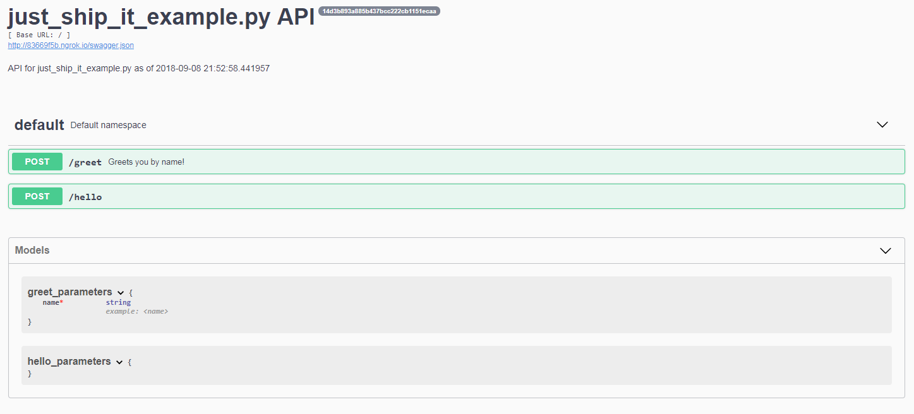

# just-ship-it 🚀
[](https://badge.fury.io/py/just-ship-it)

For when you just need to ship your Python code.

## Compatability
Python 3.6+ is required.

## Installation

```bash
pip install just-ship-it
```
### Inside Jupyter / Colab Notebooks
Notebooks have [an issue](https://stackoverflow.com/questions/51180917/python-flask-unsupportedoperation-not-writable) with newer versions of Flask, so force an older version if working in these environments.
```bash
!pip install flask==0.12.2
```
See the [example notebook](https://colab.research.google.com/github/gstaff/just-ship-it/blob/master/examples/just_ship_it_example.ipynb) for a working example.


## Quickstart
Just `from just_ship_it import ship_it` and `ship_it()`!
```python
# just_ship_it_example.py
def greet(name):
    """Greets you by name!"""
    return 'Hello {name}!'.format(name=name)

def hello():
    return {'hello': 'world'}

if __name__ == '__main__':
    from just_ship_it import ship_it
    ship_it()
```
```bash
python just_ship_it_example.py
 * Running on http://127.0.0.1:5000/ (Press CTRL+C to quit)
 * Running on http://<random-address>.ngrok.io
 * Traffic stats available on http://127.0.0.1:4040 
```
Your code is now shipped!


